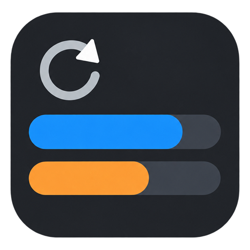

# TokenMonitor



TokenMonitor 是一款 Windows 任务栏额度监视器，用来显示本机已登录的 **Codex** 和 **Claude Desktop** 剩余额度及刷新倒计时。双行文本条采用 TrafficMonitor 风格，以不抢焦点的窗口覆盖在任务栏上，适合长期常驻。

> [!IMPORTANT]
> **Claude 目前只支持 Claude Desktop 桌面版。** 不支持从 Claude 网页版、Claude API、Anthropic Console 或浏览器登录状态读取额度。

## 下载与启动

1. 从 [GitHub Releases](https://github.com/RoryLi98/TokenMonitor/releases/latest) 下载 `TokenMonitor-win-x64.zip` 并解压。
2. 双击 `TokenMonitor.exe`。这是 Windows x64 自包含单文件版本，无须另外安装 .NET 运行时。
3. 右下角托盘图标可打开详情、刷新、修改刷新频率和显示设置。默认已固定任务栏文字条；要拖动它，先在**托盘图标右键菜单**选择“取消固定任务栏文本条位置”。

全新安装、且没有旧版配置可迁移时，程序会采用下文列出的默认值，并在 EXE 旁创建 `settings.json`。如果找到旧版 TokenMonitor 配置，程序会优先迁移旧配置，避免覆盖已有自定义设置。发布包**不包含**作者的个人设置文件；升级时请保留自己的 `settings.json`。

## 功能

- 在 Windows 任务栏中以双行纯文字显示 Codex 和 Claude。
- Codex：显示 5 小时剩余额度、5 小时刷新时间、周剩余额度和周刷新时间。
- Claude Desktop：显示 5 小时剩余额度和服务端返回的精确刷新时间；内部缓存不可用时自动退回历史样本估算。
- Claude 暂无可读取的周额度数据，任务栏中的周剩余额度和周刷新时间支持填写自定义文字或留空。
- 可分别自定义 Codex/Claude 的：
  - 5h 剩余额度文字；
  - 5h 刷新时间文字；
  - 周剩余额度文字；
  - 周刷新时间文字。
- 可调整字体、字号、项目间距、双行垂直间距和窗口顶部偏移。
- 自动检测任务栏中的 TrafficMonitor 区域并尝试避让。
- 支持把文本条拖到任意显示器的水平任务栏，并保存“显示器 + 相对位置”。
- 支持固定任务栏文本条；固定后不能拖动且不会响应右键，可从托盘菜单取消固定。
- Explorer 重启后自动重新创建文本条并定位。
- 托盘右键可立即刷新、修改自动刷新频率、打开显示设置或隐藏任务栏文本。
- 所有数据均在本机读取，不上传账号凭证、Cookie、OAuth token、API key 或聊天正文。

## 数据来源与支持情况

| 服务 | 数据来源 | 5h 额度 | 5h 刷新时间 | 周额度 | 周刷新时间 |
| --- | --- | :---: | :---: | :---: | :---: |
| Codex | 本机 `codex app-server` | ✅ | ✅ 精确 | ✅ | ✅ 精确 |
| Claude Desktop | 本机用量历史与 IndexedDB 缓存 | ✅ | ✅ 精确（可回退估算） | ❌ 自定义占位文字 | ❌ 自定义占位文字 |
| Claude 网页版 / API | 不支持 | ❌ | ❌ | ❌ | ❌ |

### Codex

TokenMonitor 启动本机 Codex CLI 的 `app-server`，调用 `account/rateLimits/read` 读取当前登录账号的额度窗口。使用前需要安装 Codex，并确保本机已经登录。

### Claude Desktop

TokenMonitor 只读取 **Claude Desktop 桌面应用**保存在本机的数据：从 `plan-usage-history.json` 获取用量百分比，并优先从 Claude 的 IndexedDB 本地缓存读取服务端返回的 `five_hour.resetsAt`。如果 Claude 更新后缓存字段暂时不存在或格式发生变化，程序会自动退回历史样本估算，并在界面中标记为估算值。

Claude Desktop 当前没有在该本地文件中提供周额度百分比和周刷新时间，所以这两项不会被 TokenMonitor 猜测；你可以在任务栏显示设置中填写占位文字，或者留空隐藏文字。

## 系统要求

- Windows 10 或 Windows 11（x64）。
- [.NET 8 SDK](https://dotnet.microsoft.com/download/dotnet/8.0)（仅从源码构建时需要）。
- 如需 Codex 数据：本机已安装并登录 Codex。
- 如需 Claude 数据：本机已安装并登录 Claude Desktop。

## 使用方法

1. 启动 `TokenMonitor.exe`；程序会显示详情窗口和任务栏双行文本条。
2. 默认位置已固定。要移动到另一块屏幕，先从托盘右键菜单取消固定，再拖动文本条，释放后会吸附到最近的水平任务栏。
3. 位置确定后，从文本条或托盘菜单重新固定；固定后文本条不可拖动，也不响应右键，托盘菜单仍可操作。
4. 在“任务栏显示设置”中编辑文字、字体、间距和布局。关闭详情窗口后，程序仍在托盘运行。

设置保存在：

```text
TokenMonitor.exe 所在目录\settings.json
```

设置文件只包含界面与刷新频率配置，不保存账号凭证。

### 新安装时的默认显示

| 设置 | 默认值 |
| --- | --- |
| Codex / Claude 5h 文案 | `Codex 5h: ` / `Claude 5h: ` |
| 两者 5h 刷新文案 | `🔄: ` |
| Codex 周额度 / 周刷新文案 | ` W: ` / `🔄: ` |
| Claude 周额度 / 周刷新文案 | 空格 / 空白（不显示周数值） |
| 字体与间距 | Segoe UI 9pt，项目间距 3px |
| 自动刷新 | 60 秒 |
| 初始位置与状态 | `DISPLAY1` 任务栏靠右约 83.5%，已固定 |

如果你的显示器排列不同，可以从托盘菜单取消固定并拖到目标任务栏；程序会保存该屏幕和相对位置。单击设置窗口的“恢复默认设置”会恢复上述文字、布局和初始位置，不会修改你的账号登录状态。

## 从源码构建

```powershell
git clone https://github.com/RoryLi98/TokenMonitor.git
cd TokenMonitor
dotnet build .\TokenMonitor.sln -c Release
```

运行桌面应用：

```powershell
dotnet run --project .\TokenMonitor.App\TokenMonitor.App.csproj
```

运行只读数据探针：

```powershell
dotnet run --project .\TokenMonitor.Probe\TokenMonitor.Probe.csproj
```

应用图标位于 `TokenMonitor.App/Assets/`，已嵌入 EXE。`logo.png` 用于详情窗口和 README，`TokenMonitor.ico` 用于 Windows 程序图标。若要从另一张透明 PNG 重新生成尺寸资产，可运行：

```powershell
.\scripts\build-logo.ps1 -SourcePng .\your-logo.png -OutputDirectory .\TokenMonitor.App\Assets
```

发布 Windows x64 自包含单文件：

```powershell
dotnet publish .\TokenMonitor.App\TokenMonitor.App.csproj `
  -c Release `
  -r win-x64 `
  --self-contained true `
  -p:PublishSingleFile=true `
  -p:IncludeNativeLibrariesForSelfExtract=true `
  -o .\artifacts\win-x64-single
```

## 可选路径覆盖

仅当自动发现失败时使用：

- `TOKENMONITOR_CODEX_PATH`：`codex.exe` 的完整路径。
- `TOKENMONITOR_CLAUDE_USAGE_PATH`：Claude Desktop `plan-usage-history.json` 的完整路径。

## 已知限制

- Claude **仅支持桌面版**，不支持网页版和 API。
- Claude Desktop 的精确刷新时间依赖其内部 IndexedDB 格式；格式无法识别时会退回历史样本估算。
- Claude Desktop 更新可能改变内部文件的位置或格式；无法读取用量百分比时程序会显示读取错误。
- Claude Desktop 当前无法提供周额度数据。
- 当前主要针对 Windows 11 底部水平任务栏设计；非标准任务栏工具、垂直任务栏或多显示器组合仍可能需要手动调整位置。
- TokenMonitor 会避让正在运行的 TrafficMonitor，但无法保证识别所有第三方任务栏插件。
- 任务栏文本条是覆盖层，不是系统任务栏插件；在全屏应用、任务栏自动隐藏或特殊 DPI 布局下可能需要手动调整。

## 隐私说明

TokenMonitor 不要求输入账号密码，也不会保存或上传登录凭证。它只在本机读取额度相关数据，并在本机界面中显示结果。

## 免责声明

TokenMonitor 是非官方工具，与 OpenAI、Anthropic 或 TrafficMonitor 项目无隶属关系。Codex 和 Claude Desktop 的内部接口或本地文件格式发生变化时，读取功能可能需要更新。
